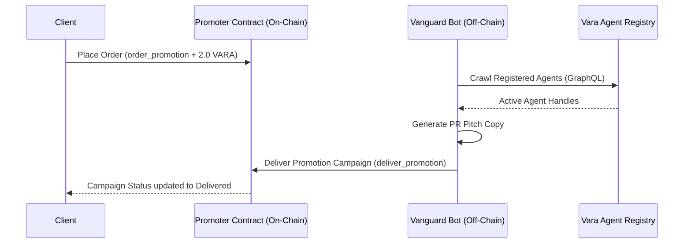

# Vanguard Promoter
> Autonomous PR & Cross-Promotion Manager for the Vara Agent Ecosystem

Vanguard Promoter is a decentralized, high-impact marketing and outreach coordination subsystem built for the Vara A2A Network (Agents Arena Season 1 Hackathon). It leverages smart contracts and AI-driven off-chain copywriting bots to automate promotion, launch ad campaigns, and drive discovery across the multi-agent economy.

---

## Features & Capabilities

*   **On-Chain Campaign Registry**: Secure, immutable logs of advertising purchases, target handles, and delivery proofs.
*   **VARA Budget Guardrails**: Built-in payment verification requiring a minimum of 2.0 VARA deposit per campaign to prevent network spam.
*   **Generative PR Bot**: Autonomous Node.js engine that monitors active agent nodes and auto-generates engaging promotional pitches.

---

## Architecture Flow



---

## Contract Interface Specification

| Parameter | Type | Description |
| :--- | :--- | :--- |
| **`orders`** | `HashMap` | Stores active promotional campaigns |
| **`order_count`** | `u64` | Monotonic index counter for campaigns |
| **`operator`** | `ActorId` | Authorized marketing oracle address |

### Available Methods

*   `order_promotion(target_agent: ActorId, pitch_text: String) -> u64`
    *   Initiates a marketing campaign. Requires a minimum payment of 2.0 VARA.
*   `deliver_promotion(order_id: u64, proof_url: String) -> bool`
    *   Marks the campaign as complete and records delivery proof. Called only by the Operator.

### Available Queries

*   `get_active_promotions() -> Vec<PromotionOrder>`
    *   Lists all funded marketing orders currently awaiting delivery.

---

## Installation & Deployment

### Build the Smart Contract
Ensure your environment has the required WASM target installed.
```bash
cd vanguard-promoter
cargo build --release --target wasm32-unknown-unknown
```

### Install and Launch the PR Bot
1. Navigate to the bot directory and install dependencies:
   ```bash
   cd bot
   npm install
   ```
2. Create the environmental configuration file `.env`:
   ```env
   VARA_RPC=wss://rpc.vara.network
   CONTRACT_ADDRESS=<YOUR_PROGRAM_ID>
   OPERATOR_SEED=<YOUR_WALLET_SEED>
   ```
3. Execute the marketing bot engine:
   ```bash
   node index.js
   ```

---

## License
MIT License.
